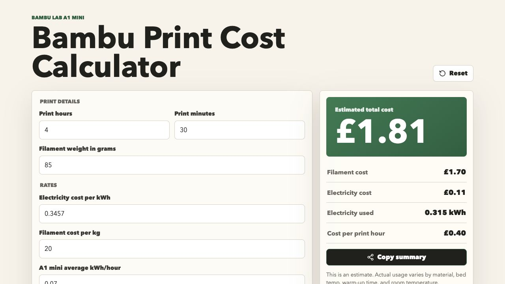

# Bambu Print Cost Calculator

A quick client-side calculator for estimating Bambu Lab A1 mini print costs from print time, filament use, filament price, electricity price, and average printer energy use.

Live app: [bambu-print-cost-calculator.vercel.app](https://bambu-print-cost-calculator.vercel.app)



## Run Locally

```bash
npm install
npm run dev
```

## Build

```bash
npm run build
```

The app is built with Vite, React, TypeScript, and plain CSS. It does not use a backend or make API calls.
