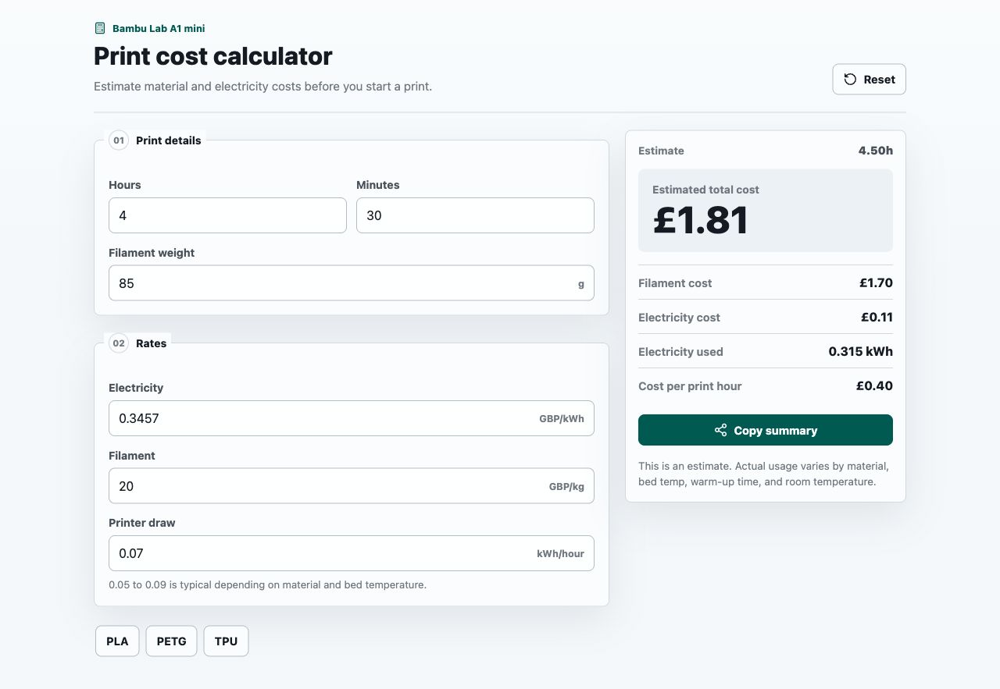

# Bambu Print Cost Calculator

A clean client-side calculator for estimating Bambu Lab A1 mini print costs from print time, filament use, material price, electricity rate, and average printer energy use.

Live app: [bambu-print-cost-calculator.vercel.app](https://bambu-print-cost-calculator.vercel.app)



## Features

- Calculates filament cost, electricity cost, electricity used, and cost per print hour.
- Includes PLA, PETG, and TPU presets for quick material estimates.
- Stores the latest inputs locally in the browser.
- Copies a ready-to-share estimate summary.

## Run Locally

```bash
npm install
npm run dev
```

## Build

```bash
npm run build
```

## Stack

Built with Vite, React, TypeScript, Lucide icons, and plain CSS. The app does not use a backend or make API calls.
